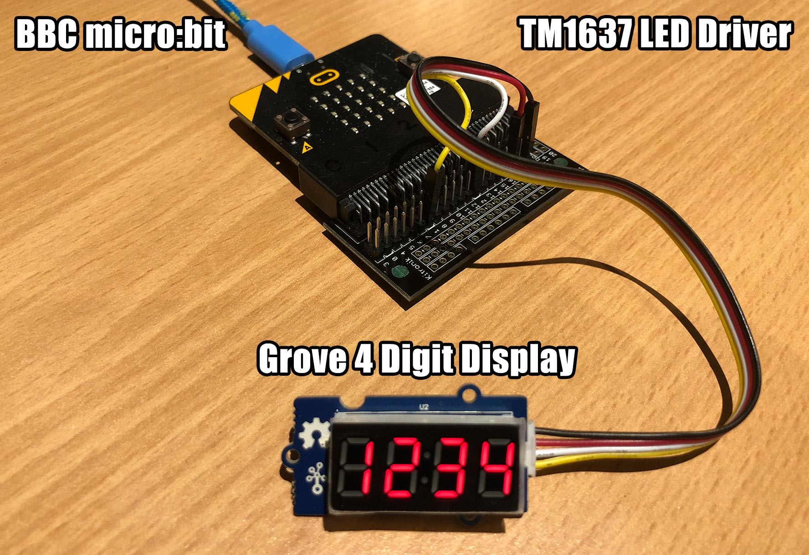

# BBC micro:bit MicroPython TM1637

A micro:bit MicroPython library for quad 7-segment LED display modules using the TM1637 LED driver.

For example, the [Grove - 4 Digit Display module](http://wiki.seeed.cc/Grove-4-Digit_Display/)



## Installation

* Install MicroPython for micro:bit by either compiling from [source](https://github.com/bbcmicrobit/micropython) or using one of the included [precompiled firmwares](/firmware)
* Install [ufs](https://github.com/ntoll/microfs) to upload .py scripts
* Copy `tm1637.py` and one of the example `main.py` scripts to the micro:bit
* Reset to run `main.py` on boot.

# Examples

There are multiple methods which can produce the same result. Here are a few examples to get you started.

```
from microbit import *
from tm1637 import TM1637
tm = TM1637(clk=pin1, dio=pin2)

# all LEDS on "88:88"
tm.write([127, 255, 127, 127])
tm.show('8888', True)
tm.numbers(88, 88)

# all LEDS off
tm.write([0, 0, 0, 0])
tm.show('    ')

# write to the 2nd and 3rd segments only
tm.write([119, 124], 1)
tm.write([124], 2)
tm.write([119], 1)

# display "0123"
tm.show('1234')
tm.number(1234)
tm.numbers(12, 34)

# show "COOL"
tm.write([0b00111001, 0b00111111, 0b00111111, 0b00111000])
tm.write([0x39, 0x3F, 0x3F, 0x38])
tm.write([57, 63, 63, 56])
tm.show('cool')
tm.show('COOL')

# display "dEAd", "bEEF"
tm.hex(0xdead)
tm.hex(0xbeef)
tm.show('dead')
tm.show('Beef')

# show "12:59"
tm.numbers(12,59)
tm.number(1259, True)
tm.show('1259', True)

# show "-123"
tm.number(-123)
tm.show('-123')

# show temperature '24*C'
tm.temperature(24)
tm.show('24*C')

# get current brightness
tm.brightness()

# reduce brightness
tm.brightness(3)
```

For more detailed examples, see /examples.

# Seven Segment Font

They are called 7-segment displays as there are 7 LEDs for each digit (segment).
One byte (7 lower bits) for each segment. The 8th bit (MSB) is for the colon and only on the 2nd segment.


```
      A
     ---
  F |   | B   *
     -G-      H (on 2nd segment)
  E |   | C   *
     ---
      D

  HGFEDCBA
0b01101101 = 0x6D = 109 = show "5"
```

Display | Bin        | Hex  | Dec
------- | ---------- | ---- | ---
0       | 0b00111111 | 0x3F | 63
1       | 0b00000110 | 0x06 | 6
2       | 0b01011011 | 0x5B | 91
3       | 0b01001111 | 0x4F | 79
4       | 0b01100110 | 0x66 | 102
5       | 0b01101101 | 0x6D | 109
6       | 0b01111101 | 0x7D | 125
7       | 0b00000111 | 0x07 | 7
8       | 0b01111111 | 0x7F | 127
9       | 0b01101111 | 0x6F | 111
A       | 0b01110111 | 0x77 | 119
b       | 0b01111100 | 0x7C | 124
C       | 0b00111001 | 0x39 | 57
d       | 0b01011110 | 0x5E | 94
E       | 0b01111001 | 0x79 | 121
F       | 0b01110001 | 0x71 | 113
G       | 0b00111101 | 0x3D | 61
H       | 0b01110110 | 0x76 | 118
I       | 0b00000110 | 0x06 | 6
J       | 0b00011110 | 0x1E | 30
K       | 0b01110110 | 0x76 | 118
L       | 0b00111000 | 0x38 | 56
M       | 0b01010101 | 0x55 | 85
n       | 0b01010100 | 0x54 | 84
O       | 0b00111111 | 0x3F | 63
P       | 0b01110011 | 0x73 | 115
q       | 0b01100111 | 0x67 | 103
r       | 0b01010000 | 0x50 | 80
S       | 0b01101101 | 0x6D | 109
t       | 0b01111000 | 0x78 | 120
U       | 0b00111110 | 0x3E | 62
v       | 0b00011100 | 0x1C | 28
W       | 0b00101010 | 0x2A | 42
X       | 0b01110110 | 0x76 | 118
y       | 0b01101110 | 0x6E | 110
Z       | 0b01011011 | 0x5B | 91
blank   | 0b00000000 | 0x00 | 0
\-      | 0b01000000 | 0x40 | 64
\*      | 0b01100011 | 0x63 | 99

# Methods

Get or set brightness.
```
brightness(val=None)
```

Write one or more segments at a given offset.
```
write(segments, pos=0)
```

Convert a string to a list of segments.
```
encode_string(string)
```

Convert a single character to a segment.
```
encode_char(char)
```

Display a number in hexadecimal format 0000 through FFFF.
```
hex(val)
```

Display a number -999 through 9999.
```
number(num)
```

Display 2 independent numbers on either side of the (optional) colon.
```
numbers(num1, num2, colon=True)
```

Display a temperature -9 through 99 followed by degrees C.
```
temperature(num)
```

Show a string on the display.
Shorthand for write(encode_string()).
```
show(string, colon=False)
```

Display a string on the display, scrolling from the left to right, speed adjustable.
```
scroll(string, delay=250)
```

## Parts

* [BBC micro:bit](https://tronixlabs.com.au/bbc-micro-bit/bbc-micro-bit-board-only-retail-pack-australia/) $24.95 AUD
* [Edge Connector Breakout Board](https://tronixlabs.com.au/bbc-micro-bit/edge-connector-breakout-board-for-bbc-micro-bit-australia/) $11.95 AUD
* [Grove 4 Digit Display](https://www.seeedstudio.com/grove-4digital-display-p-1198.html) $5.90 USD
* [Grove Male Jumper Cable](https://www.seeedstudio.com/Grove-4-pin-Male-Jumper-to-Grove-4-pin-Conversion-Cable-%285-PCs-per-Pack%29-p-1565.html) $2.90 USD

## Connections

micro:bit | Grove 4 Digit Display
--------- | ---------------
Pin 1     | CLK (yellow)
Pin 2     | DIO (white)
3V3       | VCC (red)
GND       | GND (black)

An edge connector breakout board comes in handy here.

You're welcome to change the data and clock pins to something else - just update `TM1637(clk=pin1, dio=pin2)` in your `main.py`

## Links

* [BBC micro:bit](http://microbit.org/)
* [MicroPython for the BBC micro:bit](https://github.com/bbcmicrobit/micropython)
* [Kitronik Edge Connector Breakout Board](https://www.https://www.kitronik.co.uk/5601b-edge-connector-breakout-board-for-bbc-microbit-pre-built.html.co.uk/5601b-edge-connector-breakout-board-for-bbc-microbit-pre-built.html)
* [Grove 4 Digit Display Wiki Page](http://wiki.seeed.cc/Grove-4-Digit_Display/)
* [micropython.org](http://micropython.org)
* [micro:bit on the MicroPython forum](https://forum.micropython.org/viewforum.php?f=17)
* [microfs](https://github.com/ntoll/microfs)
* [TM1637 datasheet](http://www.titanmec.com/index.php/en/project/download/id/302.html)
* [Titan Micro TM1637 product page](http://www.titanmec.com/index.php/en/project/view/id/302.html)
* [MicroPython TM1637](https://github.com/mcauser/micropython-tm1637)

# Troubleshooting

If you upload a new `.hex` file, all changes are overwritten and you will need to `ufs put` both the `tm1637.py` and `main.py` scripts again.

If you edit one of the example precompiled `.hex` files in one of the [online editors](https://python.microbit.org/v/1), it may swap the MicroPython runtime to an older version and introduce bugs.
Best to flash one of the stock MicroPython firmwares and upload your own `tm1637.py` and `main.py` scripts.

If you flash a `.hex` file from an online editor, it may block `main.py` from running as the editor combines the MicroPython runtime with your script.
Your script is executed like the main script, however, you can't `ufs get` and `ufs put` changes.

If you board is throwing MemoryErrors and you are unable to continue, start fresh by copying one of the MicroPython firmware `.hex` files to the MICROBIT mounted filesystem.
